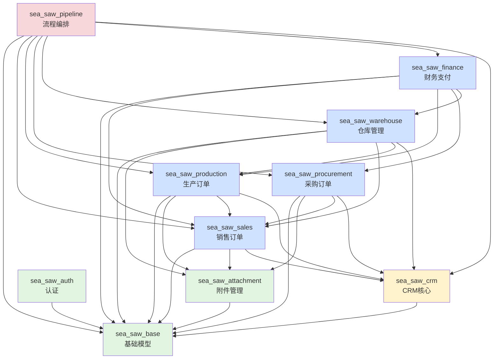

# Sea-Saw ERP 系统模块化改造计划

## 文档版本

- **版本**: v1.0
- **创建日期**: 2026-02-02
- **最后更新**: 2026-02-02
- **状态**: Phase 2.3 已完成，准备开始 Phase 2.4

## 目录

1. [概述](#概述)
2. [架构设计目标](#架构设计目标)
3. [应用拆分方案](#应用拆分方案)
4. [依赖关系图](#依赖关系图)
5. [实施阶段](#实施阶段)
6. [当前进度](#当前进度)
7. [测试验证清单](#测试验证清单)
8. [回滚方案](#回滚方案)

---

## 概述

### 背景

Sea-Saw 系统最初设计为 CRM（客户关系管理）系统，所有业务逻辑集中在 `sea_saw_crm` 单体应用中。随着业务发展，系统逐步演化为 ERP（企业资源规划）系统，涵盖销售、生产、采购、仓库、财务等多个业务模块。

### 问题

单体应用架构导致：
- **代码耦合度高**：各业务模块紧密耦合，难以独立开发和维护
- **扩展性差**：新增功能影响范围广，测试成本高
- **团队协作困难**：多个开发者同时修改同一应用，冲突频繁
- **部署风险大**：一个模块的变更需要重新部署整个应用
- **语义混乱**：应用名称 `sea_saw_crm` 不再准确反映系统功能

### 目标

将单体 `sea_saw_crm` 应用拆分为多个独立的 Django 应用，实现：
- **高内聚低耦合**：每个应用专注于单一业务领域
- **独立开发部署**：各模块可独立测试和部署
- **清晰的职责边界**：应用名称准确反映业务功能
- **更好的可维护性**：代码结构清晰，易于理解和修改
- **团队协作效率**：减少代码冲突，提升开发效率

---

## 架构设计目标

### 1. 分层架构

```
┌─────────────────────────────────────────────────┐
│              Frontend (React Native)             │
│         sea-saw-app (iOS, Android, Web)         │
└─────────────────────────────────────────────────┘
                        ▼
┌─────────────────────────────────────────────────┐
│          API Gateway (Django URL Router)         │
│        /api/sales/, /api/production/, etc.      │
└─────────────────────────────────────────────────┘
                        ▼
┌─────────────────────────────────────────────────┐
│              Business Applications               │
│  ┌──────────┬──────────┬──────────┬──────────┐  │
│  │ Sales    │Production│Procure-  │Warehouse │  │
│  │          │          │ment      │          │  │
│  ├──────────┼──────────┼──────────┼──────────┤  │
│  │ Finance  │ Pipeline │   CRM    │   Auth   │  │
│  └──────────┴──────────┴──────────┴──────────┘  │
└─────────────────────────────────────────────────┘
                        ▼
┌─────────────────────────────────────────────────┐
│            Foundation Applications               │
│    ┌──────────────┬────────────────────┐        │
│    │ sea_saw_base │ sea_saw_attachment │        │
│    └──────────────┴────────────────────┘        │
└─────────────────────────────────────────────────┘
                        ▼
┌─────────────────────────────────────────────────┐
│         Database (PostgreSQL/SQLite)             │
└─────────────────────────────────────────────────┘
```

### 2. 应用职责划分

| 应用名称 | 职责 | 核心模型 |
|---------|------|---------|
| **sea_saw_base** | 基础模型和工具类（抽象基类） | BaseModel, AbstractOrderBase, AbstarctItemBase |
| **sea_saw_attachment** | 统一附件管理 | Attachment |
| **sea_saw_auth** | 用户认证和权限管理 | User, Role |
| **sea_saw_sales** | 销售订单管理 | Order, OrderItem |
| **sea_saw_production** | 生产订单管理 | ProductionOrder, ProductionItem |
| **sea_saw_procurement** | 采购订单管理 | PurchaseOrder, PurchaseItem |
| **sea_saw_warehouse** | 仓库和出库管理 | OutboundOrder, OutboundItem |
| **sea_saw_finance** | 财务和支付管理 | Payment |
| **sea_saw_pipeline** | 业务流程编排 | Pipeline |
| **sea_saw_crm** | 核心 CRM 功能（客户、联系人、供应商等） | Company, Contact, Supplier, Contract |

### 3. 设计原则

#### 依赖方向
- **单向依赖**：业务应用依赖基础应用，基础应用不依赖业务应用
- **最小依赖**：避免业务应用之间的直接依赖
- **字符串引用**：使用 Django 的字符串引用机制（`"app_label.ModelName"`）避免循环导入

#### 数据隔离
- **独立模型**：每个应用拥有自己的模型，不共享模型定义
- **外键引用**：跨应用引用使用字符串引用或 GenericForeignKey
- **迁移独立**：每个应用有独立的迁移文件

#### API 设计
- **独立端点**：每个应用有独立的 URL 命名空间
- **RESTful**：遵循 REST 设计原则
- **版本化**：预留 API 版本化空间

---

## 应用拆分方案

### Phase 1: 基础设施应用（已完成 ✅）

#### 1.1 sea_saw_base
**创建时间**: Phase 1
**状态**: ✅ 已完成

**迁移内容**:
- 抽象基类：`BaseModel`, `AbstractOrderBase`, `AbstarctItemBase`
- 基础管理器：`BaseModelManager`
- 工具函数和混入类

**文件结构**:
```
sea_saw_base/
├── __init__.py
├── apps.py
├── models/
│   ├── __init__.py
│   ├── base.py                # BaseModel, Field
│   ├── abstract_order_base.py # AbstractOrderBase
│   └── abstract_item_base.py  # AbstarctItemBase
└── manager/
    ├── __init__.py
    └── base_model_manager.py
```

#### 1.2 sea_saw_attachment
**创建时间**: Phase 1
**状态**: ✅ 已完成

**迁移内容**:
- 统一附件模型
- 附件视图和序列化器
- 文件上传和下载逻辑

**文件结构**:
```
sea_saw_attachment/
├── __init__.py
├── apps.py
├── models/
│   ├── __init__.py
│   └── attachment.py         # Attachment
├── serializers/
│   ├── __init__.py
│   └── attachment.py
├── views/
│   ├── __init__.py
│   └── attachment_view.py    # SecureAttachmentDownloadView
├── admin/
│   ├── __init__.py
│   └── attachment.py
└── urls.py                   # /api/attachments/
```

---

### Phase 2: 业务模块拆分（进行中 🚧）

#### 2.1 sea_saw_sales（已完成 ✅）
**创建时间**: Phase 2.1
**状态**: ✅ 已完成
**API 端点**: `/api/sales/`

**迁移内容**:
- 模型：`Order`, `OrderItem`, `OrderStatusType`
- 序列化器：订单相关的所有序列化器
- 视图：`OrderViewSet`, `NestedOrderViewSet`
- 管理器：`OrderModelManager`
- Django Admin 配置

**依赖关系**:
```
sea_saw_sales
  ├── → sea_saw_base (AbstractOrderBase, AbstarctItemBase)
  ├── → sea_saw_attachment (Attachment via GenericRelation)
  └── → sea_saw_crm (Company, Contact via string reference)
```

**数据库表**:
- `sea_saw_sales_order`
- `sea_saw_sales_orderitem`

**验证结果**: ✅ 迁移成功，数据库表已创建

---

#### 2.2 sea_saw_production（已完成 ✅）
**创建时间**: Phase 2.2
**状态**: ✅ 已完成
**API 端点**: `/api/production/`

**迁移内容**:
- 模型：`ProductionOrder`, `ProductionItem`, `ProductionStatus`
- 序列化器：生产订单相关的所有序列化器（nested 和 standalone）
- 视图：`ProductionOrderViewSet`, `NestedProductionOrderViewSet`
- 工作流操作：`start_production`, `finish_production`, `report_issue`, `resolve_issue`
- Django Admin 配置

**依赖关系**:
```
sea_saw_production
  ├── → sea_saw_base (BaseModel, AbstarctItemBase)
  ├── → sea_saw_attachment (Attachment via GenericRelation)
  ├── → sea_saw_sales (Order, OrderItem)
  └── → sea_saw_crm (Pipeline via string reference)
```

**数据库表**:
- `sea_saw_production_productionorder`
- `sea_saw_production_productionitem`

**验证结果**: ✅ 迁移成功，数据库表已创建

---

#### 2.3 sea_saw_procurement（已完成 ✅）
**创建时间**: Phase 2.3
**状态**: ✅ 已完成
**API 端点**: `/api/procurement/`

**迁移内容**:
- 模型：`PurchaseOrder`, `PurchaseItem`, `PurchaseStatus`
- 序列化器：采购订单相关的所有序列化器
- 视图：`NestedPurchaseOrderViewSet`
- Django Admin 配置

**依赖关系**:
```
sea_saw_procurement
  ├── → sea_saw_base (AbstractOrderBase, AbstarctItemBase)
  ├── → sea_saw_attachment (Attachment via GenericRelation)
  ├── → sea_saw_sales (Order, OrderItem)
  ├── → sea_saw_crm (Pipeline, Supplier via string reference)
  └── → sea_saw_crm.serializers (AttachmentSerializer, mixins)
```

**数据库表**:
- `sea_saw_procurement_purchaseorder`
- `sea_saw_procurement_purchaseitem`

**验证结果**: ✅ 迁移成功，数据库表已创建

**已修复的导入问题**:
1. ✅ `sea_saw_crm/views/payment_view.py:24` - 从 `sea_saw_procurement.serializers` 导入
2. ✅ `sea_saw_procurement/views/purchase_view.py` - 修复缺少点号的导入（parsers, serializers, permissions, metadata, mixins）

---

#### 2.4 sea_saw_warehouse（待实施 📋）
**计划时间**: Phase 2.4
**状态**: 📋 待开始
**API 端点**: `/api/warehouse/`

**计划迁移内容**:
- 模型：`OutboundOrder`, `OutboundItem`, `OutboundStatus`
- 序列化器：出库订单相关的所有序列化器
- 视图：`NestedOutboundOrderViewSet`
- Django Admin 配置

**依赖关系**:
```
sea_saw_warehouse
  ├── → sea_saw_base (AbstractOrderBase, AbstarctItemBase)
  ├── → sea_saw_attachment (Attachment via GenericRelation)
  ├── → sea_saw_sales (Order, OrderItem)
  ├── → sea_saw_production (ProductionItem)
  └── → sea_saw_crm (Pipeline via string reference)
```

**数据库表**:
- `sea_saw_warehouse_outboundorder`
- `sea_saw_warehouse_outbounditem`

**实施步骤**:
1. 创建 `sea_saw_warehouse` 应用结构
2. 复制 `OutboundOrder` 和 `OutboundItem` 模型
3. 更新模型中的外键引用（使用字符串引用）
4. 复制序列化器、视图、管理界面
5. 创建 URLs 配置
6. 更新 `INSTALLED_APPS` 和主 URL 路由
7. 更新所有 `OutboundOrder` 引用
8. 删除 `sea_saw_crm` 中的旧代码
9. 重新创建迁移并应用

---

#### 2.5 sea_saw_finance（待实施 📋）
**计划时间**: Phase 2.5
**状态**: 📋 待开始
**API 端点**: `/api/finance/`

**计划迁移内容**:
- 模型：`Payment` (及相关枚举)
- 序列化器：支付相关的所有序列化器
- 视图：`PaymentViewSet`, `NestedPaymentViewSet`, `PaymentRecordViewSet`, `NestedPaymentRecordViewSet`
- Django Admin 配置

**依赖关系**:
```
sea_saw_finance
  ├── → sea_saw_base (BaseModel)
  ├── → sea_saw_sales (Order via GenericForeignKey)
  ├── → sea_saw_production (ProductionOrder via GenericForeignKey)
  ├── → sea_saw_procurement (PurchaseOrder via GenericForeignKey)
  └── → sea_saw_warehouse (OutboundOrder via GenericForeignKey)
```

**数据库表**:
- `sea_saw_finance_payment`

**特殊考虑**:
- Payment 使用 `GenericForeignKey` 关联多种订单类型
- 需要更新 `ContentType` 相关的查询逻辑
- 支付视图有多个别名（PaymentRecord*），需保持向后兼容

---

### Phase 3: 流程编排应用（待实施 📋）

#### 3.1 sea_saw_pipeline（待实施 📋）
**计划时间**: Phase 3.1
**状态**: 📋 待开始
**API 端点**: `/api/pipeline/`

**计划迁移内容**:
- 模型：`Pipeline`, `PipelineStatusType`, `PipelineType`
- 序列化器：Pipeline 相关的所有序列化器
- 视图：`PipelineViewSet`
- 管理器：`PipelineModelManager`
- 服务：`PipelineStateService`, `StatusSyncService`
- 信号：状态同步信号处理
- Django Admin 配置

**依赖关系**:
```
sea_saw_pipeline
  ├── → sea_saw_base (BaseModel)
  ├── → sea_saw_sales (Order)
  ├── → sea_saw_production (ProductionOrder)
  ├── → sea_saw_procurement (PurchaseOrder)
  ├── → sea_saw_warehouse (OutboundOrder)
  ├── → sea_saw_finance (Payment)
  └── → sea_saw_crm (Company, Contact)
```

**数据库表**:
- `sea_saw_pipeline_pipeline`

**特殊考虑**:
- Pipeline 是业务流程的核心编排器
- 依赖所有业务模块，需要最后迁移
- 包含复杂的状态同步逻辑
- 需要仔细测试各模块之间的联动

**实施步骤**:
1. 确保 Phase 2 所有应用都已完成
2. 创建 `sea_saw_pipeline` 应用结构
3. 复制 `Pipeline` 模型和枚举
4. 更新所有外键引用（指向新的应用）
5. 复制 `PipelineModelManager`（处理跨应用的 CRUD 逻辑）
6. 复制状态同步服务（`PipelineStateService`, `StatusSyncService`）
7. 迁移信号处理器（`signals.py`）
8. 复制序列化器（包含所有子订单的序列化器）
9. 复制视图和权限
10. 创建 URLs 配置
11. 更新 `INSTALLED_APPS` 和主 URL 路由
12. 更新所有 `Pipeline` 引用
13. 删除 `sea_saw_crm` 中的旧代码
14. 重新创建迁移并应用
15. 全面测试业务流程（创建订单 → 生产 → 采购 → 出库 → 支付）

---

### Phase 4: 清理 sea_saw_crm（待实施 📋）

#### 4.1 清理和重构（待实施 📋）
**计划时间**: Phase 4
**状态**: 📋 待开始

**目标**:
将 `sea_saw_crm` 精简为核心 CRM 功能，只保留客户关系管理相关的模型。

**保留内容**:
- 模型：`Company`, `Contact`, `Supplier`, `Contract`, `Field`
- 基础序列化器：`BaseSerializer` 及相关 mixins
- 视图：公司、联系人、供应商相关的 ViewSet
- 权限：基础权限类
- 元数据：基础元数据类
- Django Admin 配置

**删除内容**:
- ✅ Order 相关（已迁移到 sea_saw_sales）
- ✅ ProductionOrder 相关（已迁移到 sea_saw_production）
- ⚠️ PurchaseOrder 相关（正在迁移到 sea_saw_procurement）
- 📋 OutboundOrder 相关（待迁移到 sea_saw_warehouse）
- 📋 Payment 相关（待迁移到 sea_saw_finance）
- 📋 Pipeline 相关（待迁移到 sea_saw_pipeline）

**重构任务**:
1. 整理 `models/__init__.py`（只导出 CRM 核心模型）
2. 整理 `serializers/__init__.py`（只导出基础序列化器）
3. 整理 `views/__init__.py`（只导出 CRM 视图）
4. 整理 `admin/__init__.py`（只导出 CRM 管理界面）
5. 整理 `urls.py`（只保留 CRM 端点）
6. 更新 API 文档
7. 清理未使用的导入和依赖

**验证**:
- 确保 `/api/sea-saw-crm/` 端点只包含 CRM 功能
- 确保没有循环依赖
- 运行所有测试确保功能正常

---

### Phase 5: 前端适配（待实施 📋）

#### 5.1 更新 API 端点（待实施 📋）
**计划时间**: Phase 5
**状态**: 📋 待开始

**目标**:
更新前端代码以使用新的 API 端点。

**文件**: `sea-saw-app/constants/Constants.ts`

**当前端点**:
```typescript
export const API_ENDPOINTS = {
  order: '/api/sea-saw-crm/orders/',
  production: '/api/sea-saw-crm/production-orders/',
  purchase: '/api/sea-saw-crm/nested-purchase-orders/',
  outbound: '/api/sea-saw-crm/nested-outbound-orders/',
  payment: '/api/sea-saw-crm/payments/',
  pipeline: '/api/sea-saw-crm/pipelines/',
  // ...
};
```

**新端点**:
```typescript
export const API_ENDPOINTS = {
  // Sales
  order: '/api/sales/orders/',
  nestedOrder: '/api/sales/nested-orders/',

  // Production
  production: '/api/production/production-orders/',
  nestedProduction: '/api/production/nested-production-orders/',

  // Procurement
  purchase: '/api/procurement/nested-purchase-orders/',

  // Warehouse
  outbound: '/api/warehouse/nested-outbound-orders/',

  // Finance
  payment: '/api/finance/payments/',
  nestedPayment: '/api/finance/nested-payments/',

  // Pipeline
  pipeline: '/api/pipeline/pipelines/',

  // CRM (unchanged)
  company: '/api/sea-saw-crm/companies/',
  contact: '/api/sea-saw-crm/contacts/',
  // ...
};
```

**实施步骤**:
1. 更新 `Constants.ts` 中的所有 API 端点
2. 搜索并替换前端代码中的硬编码端点
3. 更新 `useDataService` hook 的 URL 映射
4. 更新所有页面组件中的 `getViewSet` 调用
5. 测试所有 CRUD 操作
6. 更新前端文档

**测试清单**:
- [ ] 订单列表页面加载正常
- [ ] 创建新订单功能正常
- [ ] 编辑订单功能正常
- [ ] 删除订单功能正常
- [ ] 生产订单相关操作正常
- [ ] 采购订单相关操作正常
- [ ] 出库订单相关操作正常
- [ ] 支付记录相关操作正常
- [ ] Pipeline 流程正常
- [ ] 附件上传下载正常

---

### Phase 6: 数据库迁移和全面测试（待实施 📋）

#### 6.1 生产环境迁移（待实施 📋）
**计划时间**: Phase 6
**状态**: 📋 待开始

**目标**:
在生产环境中安全地迁移数据库。

**迁移策略**:
由于是数据库表重命名（而非数据迁移），建议采用**重建数据库**的方式：

**方案 A：重建数据库（推荐用于开发/测试环境）**
```bash
# 1. 备份数据库
pg_dump sea_saw_db > backup_$(date +%Y%m%d_%H%M%S).sql

# 2. 删除所有迁移文件
find . -path "*/migrations/*.py" -not -name "__init__.py" -delete

# 3. 删除数据库
dropdb sea_saw_db
createdb sea_saw_db

# 4. 重新创建迁移
python manage.py makemigrations

# 5. 应用迁移
python manage.py migrate

# 6. 创建超级用户
python manage.py createsuperuser

# 7. 重新导入数据（如需要）
```

**方案 B：保留数据迁移（推荐用于生产环境）**
```bash
# 1. 备份数据库
pg_dump sea_saw_db > backup_$(date +%Y%m%d_%H%M%S).sql

# 2. 创建迁移脚本，重命名表
# 示例：将 sea_saw_crm_order 重命名为 sea_saw_sales_order
python manage.py makemigrations --empty sea_saw_sales

# 3. 编辑迁移文件，添加 RenameModel 操作
# operations = [
#     migrations.RenameModel(
#         old_name='Order',
#         new_name='Order',
#     ),
# ]

# 4. 应用迁移
python manage.py migrate

# 5. 验证数据完整性
python manage.py check
```

**注意事项**:
- ⚠️ 生产环境务必先备份数据库
- ⚠️ 在测试环境完整验证后再在生产环境执行
- ⚠️ 准备回滚方案
- ⚠️ 选择业务低峰期执行

#### 6.2 全面测试（待实施 📋）

**单元测试**:
```bash
# 测试所有应用
python manage.py test

# 测试特定应用
python manage.py test sea_saw_sales
python manage.py test sea_saw_production
python manage.py test sea_saw_procurement
python manage.py test sea_saw_warehouse
python manage.py test sea_saw_finance
python manage.py test sea_saw_pipeline
```

**集成测试**:
- [ ] 完整业务流程测试（创建订单 → Pipeline → 生产 → 采购 → 出库 → 支付）
- [ ] 跨应用引用测试
- [ ] 权限控制测试
- [ ] 附件上传下载测试
- [ ] 状态同步测试

**性能测试**:
- [ ] API 响应时间（确保没有性能退化）
- [ ] 数据库查询优化（检查 N+1 查询问题）
- [ ] 并发测试

**前端测试**:
- [ ] 所有页面正常加载
- [ ] CRUD 操作功能正常
- [ ] 表单验证正常
- [ ] 文件上传下载正常
- [ ] 权限控制正常

---

## 依赖关系图

### 应用依赖关系



### 图例说明

- **绿色** (sea_saw_base, sea_saw_attachment, sea_saw_auth): 基础设施应用
- **黄色** (sea_saw_crm): 核心 CRM 应用
- **蓝色** (sales, production, procurement, warehouse, finance): 业务模块应用
- **红色** (pipeline): 流程编排应用（最复杂，依赖最多）

### 依赖原则

1. **基础应用** (sea_saw_base, sea_saw_attachment): 不依赖任何业务应用
2. **CRM 应用** (sea_saw_crm): 只依赖基础应用
3. **业务应用** (sales, production, etc.): 依赖基础应用和 CRM，可能相互依赖
4. **编排应用** (pipeline): 依赖所有其他应用，最后迁移

---

## 实施阶段

### 时间线

| 阶段 | 状态 | 开始时间 | 完成时间 | 负责人 |
|------|------|----------|----------|--------|
| Phase 1: 基础设施 | ✅ 已完成 | - | - | - |
| Phase 2.1: Sales | ✅ 已完成 | 2026-02-02 | 2026-02-02 | - |
| Phase 2.2: Production | ✅ 已完成 | 2026-02-02 | 2026-02-02 | - |
| Phase 2.3: Procurement | ✅ 已完成 | 2026-02-02 | 2026-02-02 | - |
| Phase 2.4: Warehouse | 📋 待开始 | 待定 | 待定 | - |
| Phase 2.5: Finance | 📋 待开始 | 待定 | 待定 | - |
| Phase 3: Pipeline | 📋 待开始 | 待定 | 待定 | - |
| Phase 4: 清理 CRM | 📋 待开始 | 待定 | 待定 | - |
| Phase 5: 前端适配 | 📋 待开始 | 待定 | 待定 | - |
| Phase 6: 全面测试 | 📋 待开始 | 待定 | 待定 | - |

---

## 当前进度

### ✅ Phase 2.1: sea_saw_sales - 已完成

**完成日期**: 2026-02-02

**完成内容**:
- ✅ 创建 sea_saw_sales 应用结构
- ✅ 迁移 Order 和 OrderItem 模型
- ✅ 迁移 OrderModelManager
- ✅ 迁移所有序列化器（nested 和 standalone）
- ✅ 迁移视图（OrderViewSet, NestedOrderViewSet）
- ✅ 迁移 Django Admin 配置
- ✅ 创建 URLs 配置
- ✅ 更新 INSTALLED_APPS 和主 URL 路由
- ✅ 更新所有 Order 引用（models, serializers, views, admin, signals, etc.）
- ✅ 删除 sea_saw_crm 中的旧代码
- ✅ 重新创建迁移并应用
- ✅ 验证数据库表已创建

**数据库验证**:
```bash
$ python manage.py showmigrations sea_saw_sales
sea_saw_sales
 [X] 0001_initial

$ sqlite3 db.sqlite3
sqlite> .tables
sea_saw_sales_order
sea_saw_sales_orderitem
```

---

### ✅ Phase 2.2: sea_saw_production - 已完成

**完成日期**: 2026-02-02

**完成内容**:
- ✅ 创建 sea_saw_production 应用结构
- ✅ 迁移 ProductionOrder 和 ProductionItem 模型
- ✅ 迁移所有序列化器（nested 和 standalone）
- ✅ 迁移视图（ProductionOrderViewSet, NestedProductionOrderViewSet）
- ✅ 迁移工作流操作（start_production, finish_production, report_issue, resolve_issue）
- ✅ 迁移 Django Admin 配置
- ✅ 创建 URLs 配置
- ✅ 更新 INSTALLED_APPS 和主 URL 路由
- ✅ 更新所有 ProductionOrder 引用
- ✅ 删除 sea_saw_crm 中的旧代码
- ✅ 重新创建迁移并应用
- ✅ 验证数据库表已创建

**数据库验证**:
```bash
$ python manage.py showmigrations sea_saw_production
sea_saw_production
 [X] 0001_initial

$ sqlite3 db.sqlite3
sqlite> .tables
sea_saw_production_productionorder
sea_saw_production_productionitem
```

---

### ✅ Phase 2.3: sea_saw_procurement - 已完成

**完成日期**: 2026-02-02

**完成内容**:
- ✅ 创建 sea_saw_procurement 应用结构
- ✅ 迁移 PurchaseOrder 和 PurchaseItem 模型
- ✅ 迁移所有序列化器（nested 和 standalone）
- ✅ 迁移视图（NestedPurchaseOrderViewSet）
- ✅ 迁移 Django Admin 配置
- ✅ 创建 URLs 配置
- ✅ 更新 INSTALLED_APPS 和主 URL 路由
- ✅ 更新所有 PurchaseOrder 引用
- ✅ 修复 sea_saw_crm/views/payment_view.py 中的导入错误
- ✅ 修复 sea_saw_procurement/views/purchase_view.py 中的导入错误
- ✅ 删除 sea_saw_crm 中的旧代码
- ✅ 重新创建迁移并应用
- ✅ 验证数据库表已创建

**数据库验证**:
```bash
$ python manage.py showmigrations sea_saw_procurement
sea_saw_procurement
 [X] 0001_initial

$ sqlite3 db.sqlite3
sqlite> .tables
sea_saw_procurement_purchaseorder
sea_saw_procurement_purchaseitem
```

**修复的导入问题**:
1. ✅ `sea_saw_crm/views/payment_view.py:24` - 改为从 `sea_saw_procurement.serializers` 导入
2. ✅ `sea_saw_procurement/views/purchase_view.py` - 修复所有缺少点号的导入错误：
   - `sea_saw_crmparsers` → `sea_saw_crm.parsers`
   - `sea_saw_crmserializers` → `sea_saw_procurement.serializers`
   - `sea_saw_crmpermissions` → `sea_saw_crm.permissions`
   - `sea_saw_crmmetadata` → `sea_saw_crm.metadata`
   - `sea_saw_crmmixins` → `sea_saw_crm.mixins`

---

### 📋 Phase 2.4: sea_saw_warehouse - 待开始

**计划内容**: 参见 [应用拆分方案 - 2.4 sea_saw_warehouse](#24-sea_saw_warehouse待实施-)

---

### 📋 Phase 2.5: sea_saw_finance - 待开始

**计划内容**: 参见 [应用拆分方案 - 2.5 sea_saw_finance](#25-sea_saw_finance待实施-)

---

### ✅ Phase 3: sea_saw_pipeline - 已完成

**状态**: ✅ 完成于 2026-02-02

**已完成任务**:
- ✅ 创建 sea_saw_pipeline 应用
- ✅ 迁移 Pipeline 模型及其枚举类型（PipelineStatusType, PipelineType, ActiveEntityType）
- ✅ 迁移 PipelineModelManager 和所有自定义管理器方法
- ✅ 迁移 Pipeline 序列化器（针对不同角色的序列化器）
- ✅ 迁移 PipelineViewSet 及所有自定义 actions
- ✅ 迁移 Pipeline 权限类（PipelineAdminPermission, PipelineSalePermission, etc.）
- ✅ 迁移状态机配置和常量
- ✅ 迁移 Pipeline 服务层（PipelineService, PipelineStateService, StatusSyncService）
- ✅ 迁移信号处理器（signal handlers）
- ✅ 修复所有导入语句错误
- ✅ 更新跨应用引用（sales, production, procurement, warehouse, finance）
- ✅ 从 sea_saw_crm 中移除所有旧 Pipeline 代码
- ✅ 更新 URL 路由到 `/api/pipeline/`
- ✅ 创建并应用数据库迁移
- ✅ 验证数据库表创建成功（sea_saw_pipeline_pipeline）
- ✅ 验证 API 端点正常工作

**数据库验证**:
```bash
$ python manage.py shell -c "from sea_saw_pipeline.models import Pipeline; print('Pipeline model imported successfully')"
Pipeline model imported successfully

$ sqlite3 db.sqlite3
sqlite> .tables
sea_saw_pipeline_pipeline
```

**API 端点**:
- `/api/pipeline/` - Pipeline 列表和创建
- `/api/pipeline/{id}/` - Pipeline 详情、更新、删除
- `/api/pipeline/{id}/transition/` - 状态转换
- `/api/pipeline/{id}/create_order/` - 创建订单
- `/api/pipeline/{id}/create_production/` - 创建生产订单
- `/api/pipeline/{id}/create_purchase/` - 创建采购订单
- `/api/pipeline/{id}/create_outbound/` - 创建出库订单
- `/api/pipeline/{id}/update_amounts/` - 更新金额

**修复的导入问题**:
1. ✅ 修复 `pipeline_view.py` 中的导入语法错误
2. ✅ 将 `PipelineStatus` 和 `PipelineTypeAccess` 添加到 constants 导出
3. ✅ 更新所有应用中的序列化器导入：
   - `sea_saw_sales/views/order_view.py`
   - `sea_saw_production/views/production_view.py`
   - `sea_saw_procurement/views/purchase_view.py`
   - `sea_saw_warehouse/views/outbound_view.py`
   - `sea_saw_finance/views/payment_view.py`
4. ✅ 更新 `sea_saw_finance.Payment` 模型的外键引用
5. ✅ 清理 sea_saw_crm 中的所有 Pipeline 相关代码

---

## 测试验证清单

### 单元测试

#### sea_saw_sales
- [ ] Order 模型创建和保存
- [ ] OrderItem 模型创建和保存
- [ ] OrderModelManager 的自定义方法
- [ ] 序列化器验证逻辑
- [ ] ViewSet CRUD 操作

#### sea_saw_production
- [ ] ProductionOrder 模型创建和保存
- [ ] ProductionItem 模型创建和保存
- [ ] 生产状态流转（draft → active → completed）
- [ ] 工作流操作（start_production, finish_production, etc.）
- [ ] 序列化器验证逻辑
- [ ] ViewSet CRUD 操作

#### sea_saw_procurement
- [ ] PurchaseOrder 模型创建和保存
- [ ] PurchaseItem 模型创建和保存
- [ ] 采购单号自动生成
- [ ] 总金额自动计算
- [ ] 序列化器验证逻辑
- [ ] ViewSet CRUD 操作

#### sea_saw_warehouse
- [ ] OutboundOrder 模型创建和保存
- [ ] OutboundItem 模型创建和保存
- [ ] 出库状态流转
- [ ] 序列化器验证逻辑
- [ ] ViewSet CRUD 操作

#### sea_saw_finance
- [ ] Payment 模型创建和保存
- [ ] GenericForeignKey 关联测试
- [ ] 支付状态验证
- [ ] 序列化器验证逻辑
- [ ] ViewSet CRUD 操作

#### sea_saw_pipeline
- [ ] Pipeline 模型创建和保存
- [ ] PipelineModelManager 方法测试
- [ ] 状态同步服务测试
- [ ] 信号处理器测试
- [ ] 序列化器验证逻辑
- [ ] ViewSet CRUD 操作

---

### 集成测试

#### 完整业务流程测试
1. [ ] **创建销售订单**
   - 创建客户（Company）
   - 创建联系人（Contact）
   - 创建销售订单（Order）
   - 添加订单明细（OrderItem）

2. [ ] **创建 Pipeline**
   - 从销售订单创建 Pipeline
   - 验证 Pipeline 状态
   - 验证关联关系

3. [ ] **创建生产订单**
   - 从 Pipeline 创建 ProductionOrder
   - 验证生产订单明细自动复制
   - 验证生产状态流转
   - 测试工作流操作

4. [ ] **创建采购订单**
   - 从 Pipeline 创建 PurchaseOrder
   - 选择供应商（Supplier）
   - 验证采购订单明细
   - 验证总金额计算

5. [ ] **创建出库订单**
   - 从 Pipeline 创建 OutboundOrder
   - 验证出库订单明细
   - 验证库存关联

6. [ ] **创建支付记录**
   - 为订单创建支付记录
   - 验证 GenericForeignKey 关联
   - 验证支付金额和状态

7. [ ] **状态同步测试**
   - 修改子订单状态
   - 验证 Pipeline 状态自动同步
   - 验证信号处理器工作正常

#### 跨应用引用测试
- [ ] Order → Company/Contact 外键
- [ ] ProductionOrder → Pipeline 外键
- [ ] ProductionOrder → Order 外键（legacy）
- [ ] ProductionItem → OrderItem 外键
- [ ] PurchaseOrder → Pipeline 外键
- [ ] PurchaseOrder → Order 外键（legacy）
- [ ] PurchaseOrder → Supplier 外键
- [ ] PurchaseItem → OrderItem 外键
- [ ] OutboundOrder → Pipeline 外键
- [ ] OutboundItem → OrderItem 外键
- [ ] OutboundItem → ProductionItem 外键
- [ ] Payment → Order/ProductionOrder/PurchaseOrder/OutboundOrder (GenericForeignKey)
- [ ] Pipeline → Order 外键

#### 附件管理测试
- [ ] 为 Order 上传附件
- [ ] 为 ProductionOrder 上传附件
- [ ] 为 PurchaseOrder 上传附件
- [ ] 为 OutboundOrder 上传附件
- [ ] 下载附件（权限控制）
- [ ] 删除附件

#### 权限控制测试
- [ ] ADMIN 角色权限（完全访问）
- [ ] SALE 角色权限（销售相关）
- [ ] PRODUCTION 角色权限（生产相关）
- [ ] WAREHOUSE 角色权限（仓库相关）
- [ ] 跨角色访问限制

---

### API 测试

#### 端点可访问性
- [ ] `GET /api/sales/orders/` - 列表
- [ ] `POST /api/sales/orders/` - 创建
- [ ] `GET /api/sales/orders/{id}/` - 详情
- [ ] `PUT /api/sales/orders/{id}/` - 更新
- [ ] `DELETE /api/sales/orders/{id}/` - 删除
- [ ] `GET /api/sales/nested-orders/` - 嵌套列表
- [ ] `POST /api/sales/nested-orders/` - 嵌套创建
- [ ] `GET /api/production/production-orders/` - 列表
- [ ] `POST /api/production/production-orders/` - 创建
- [ ] `POST /api/production/production-orders/{id}/start_production/` - 工作流操作
- [ ] `GET /api/procurement/nested-purchase-orders/` - 嵌套列表
- [ ] `POST /api/procurement/nested-purchase-orders/` - 嵌套创建
- [ ] `GET /api/warehouse/nested-outbound-orders/` - 嵌套列表
- [ ] `GET /api/finance/payments/` - 列表
- [ ] `GET /api/pipeline/pipelines/` - 列表

#### 序列化器测试
- [ ] OPTIONS 请求返回正确的字段元数据
- [ ] 必填字段验证
- [ ] 字段类型验证
- [ ] 自定义验证逻辑
- [ ] 嵌套序列化器（包含子明细）
- [ ] 只读字段正确设置

#### 过滤和排序
- [ ] 按状态过滤
- [ ] 按日期范围过滤
- [ ] 按客户过滤
- [ ] 按创建时间排序
- [ ] 按更新时间排序
- [ ] 搜索功能

---

### 性能测试

#### 数据库查询优化
- [ ] 检查 N+1 查询问题
- [ ] 使用 `select_related` 优化外键查询
- [ ] 使用 `prefetch_related` 优化多对多查询
- [ ] 添加必要的数据库索引

#### 响应时间
- [ ] 列表接口响应时间 < 500ms
- [ ] 详情接口响应时间 < 200ms
- [ ] 创建接口响应时间 < 1s
- [ ] 更新接口响应时间 < 1s

#### 并发测试
- [ ] 100 并发用户正常访问
- [ ] 1000 并发用户正常访问
- [ ] 无数据库死锁

---

### 前端测试

#### 页面加载
- [ ] 订单列表页面正常加载
- [ ] 订单详情页面正常加载
- [ ] 创建订单页面正常加载
- [ ] 编辑订单页面正常加载
- [ ] 生产订单页面正常加载
- [ ] 采购订单页面正常加载
- [ ] 出库订单页面正常加载
- [ ] 支付记录页面正常加载
- [ ] Pipeline 页面正常加载

#### CRUD 操作
- [ ] 创建订单功能正常
- [ ] 编辑订单功能正常
- [ ] 删除订单功能正常
- [ ] 添加订单明细功能正常
- [ ] 编辑订单明细功能正常
- [ ] 删除订单明细功能正常

#### 文件上传下载
- [ ] 上传附件功能正常
- [ ] 下载附件功能正常
- [ ] 预览附件功能正常
- [ ] 删除附件功能正常

#### 表单验证
- [ ] 必填字段验证正常
- [ ] 字段格式验证正常
- [ ] 自定义验证规则正常
- [ ] 错误信息显示正确

#### 权限控制
- [ ] 不同角色看到的菜单不同
- [ ] 不同角色的操作权限不同
- [ ] 未授权操作显示错误提示

---

## 回滚方案

### 紧急回滚

如果在生产环境迁移后发现严重问题，可以立即回滚到迁移前的状态。

#### 前提条件
- ✅ 已备份数据库
- ✅ 已保存旧代码版本（git tag）

#### 回滚步骤

**1. 停止应用服务**
```bash
# 停止所有相关服务
docker-compose -f docker-compose.prod.yml down
```

**2. 恢复数据库**
```bash
# 恢复数据库备份
psql sea_saw_db < backup_20260202_HHMMSS.sql
```

**3. 回滚代码**
```bash
# 切换到迁移前的 git tag
git checkout pre-modularization
```

**4. 重启应用服务**
```bash
docker-compose -f docker-compose.prod.yml up -d
```

**5. 验证**
```bash
# 检查服务状态
curl http://localhost/health/

# 检查 API 端点
curl http://localhost/api/sea-saw-crm/orders/
```

---

### 部分回滚

如果只是某个应用有问题，可以只回滚该应用。

**示例：回滚 sea_saw_procurement**

```bash
# 1. 移除新应用
sed -i '' '/sea_saw_procurement/d' sea_saw_server/settings.py

# 2. 恢复旧代码
git checkout pre-modularization -- sea_saw_crm/models/purchase
git checkout pre-modularization -- sea_saw_crm/serializers/purchase
git checkout pre-modularization -- sea_saw_crm/views/purchase_view.py
git checkout pre-modularization -- sea_saw_crm/admin/purchase.py

# 3. 恢复 imports
git checkout pre-modularization -- sea_saw_crm/models/__init__.py
git checkout pre-modularization -- sea_saw_crm/serializers/__init__.py
git checkout pre-modularization -- sea_saw_crm/views/__init__.py
git checkout pre-modularization -- sea_saw_crm/admin/__init__.py
git checkout pre-modularization -- sea_saw_crm/urls.py

# 4. 删除迁移
rm -rf sea_saw_procurement

# 5. 重新创建迁移
rm -f db.sqlite3
find . -path "*/migrations/*.py" -not -name "__init__.py" -delete
python manage.py makemigrations
python manage.py migrate

# 6. 重启服务
docker-compose -f docker-compose.prod.yml restart
```

---

## 附录

### A. 常用命令

#### 开发环境

```bash
# 启动开发服务器
python manage.py runserver

# 创建迁移
python manage.py makemigrations

# 应用迁移
python manage.py migrate

# 查看迁移状态
python manage.py showmigrations

# 运行测试
python manage.py test

# Django Shell
python manage.py shell

# 检查项目配置
python manage.py check

# 收集静态文件
python manage.py collectstatic --noinput

# 创建超级用户
python manage.py createsuperuser
```

#### 生产环境

```bash
# 启动生产环境
docker-compose -f docker-compose.prod.yml up -d

# 查看日志
docker-compose -f docker-compose.prod.yml logs -f

# 进入容器
docker-compose -f docker-compose.prod.yml exec web bash

# 重启服务
docker-compose -f docker-compose.prod.yml restart

# 停止服务
docker-compose -f docker-compose.prod.yml down

# 重新构建
docker-compose -f docker-compose.prod.yml up -d --build
```

#### 数据库操作

```bash
# 备份数据库 (PostgreSQL)
pg_dump sea_saw_db > backup_$(date +%Y%m%d_%H%M%S).sql

# 恢复数据库 (PostgreSQL)
psql sea_saw_db < backup_20260202_HHMMSS.sql

# 连接数据库 (SQLite)
sqlite3 db.sqlite3

# 连接数据库 (PostgreSQL)
psql -U postgres -h localhost sea_saw_db
```

---

### B. 相关文档

- [Django 文档 - 应用和项目](https://docs.djangoproject.com/en/5.1/ref/applications/)
- [Django 文档 - 模型迁移](https://docs.djangoproject.com/en/5.1/topics/migrations/)
- [Django 文档 - 模型字段引用](https://docs.djangoproject.com/en/5.1/ref/models/fields/#django.db.models.ForeignKey)
- [Sea-Saw CLAUDE.md](../CLAUDE.md) - 项目总体文档
- [Three Repo Architecture](../../docs/architecture/three-repo-architecture.md) - 三仓库架构文档

---

### C. 联系方式

如有问题或需要帮助，请联系：
- **开发团队**: [开发者邮箱]
- **GitHub Issues**: [项目 GitHub 仓库]

---

**文档结束**
